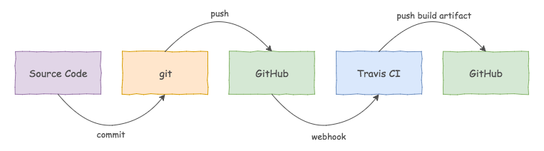

[](https://travis-ci.org/garystafford/fav-color-service)

# Favorite Color μService

## Introduction

The Favorite Color Spring Boot μService is part of a multi-tier, Angular-Node-Spring-MongoDB sample application platform. The [Favorite Color Web Application](https://github.com/garystafford/fav-color-ngweb) makes RESTful API calls to the Favorite Color μService, via the Node-based [Web BFF](https://github.com/garystafford/fav-color-bff). The Favorite Color Service is backed by MongoDB.

The Favorite Color μService exposes several HTTP endpoints, listed below. Calling those endpoints, end-users can review color choices, submit a favorite color, view all the results, and view the favorite. End-users can also create random data for simulations.

The entire sample application platform is designed to be provisioned and deployed to AWS, using HashiCorp Packer and Terraform. The web application and BFF are designed to sit in the public subnet behind a load balancer, while the μService(s) and database(s) sit in the private subnet, also behind an internal load balancer.

## Quick Start

The Favorite Color μService requires MongoDB to be pre-installed and running locally, on port `27017`.
To clone, build, test, and run the service:

```bash
git clone https://github.com/garystafford/fav-color-service.git
cd fav-color-service
./gradlew clean cleanTest build
java -jar build/libs/fav-color-0.2.0.jar
```

## Service Endpoints
Out of the box, the service runs on `localhost`, port `8091`. By default, the service looks for MongoDB on `localhost`, port `27017`.

- Create Random Sample Data (GET): <http://localhost:8091/simulation>
- List Color Choices (GET): <http://localhost:8091/choices>
- Submit Favorite Color (POST): <http://localhost:8091/colors>
- View Results Summary (GET): <http://localhost:8091/results>
- View Favorite Color (GET): <http://localhost:8091/favorite>
- Service Health (GET): <http://localhost:8091/health>
- Service Metrics (GET): <http://localhost:8091/metrics>
- Other [Spring Actuator](http://docs.spring.io/spring-boot/docs/current/reference/htmlsingle/#production-ready) endpoints include: `/mappings`, `/env`, `/configprops`, etc.
- Other [HATEOAS](https://spring.io/guides/gs/rest-hateoas) endpoints for `/colors` include: DELETE, PATCH, PUT, page sort, size, etc.

## POST Color Choice

HTTPie

```text
http POST localhost:8091/colors color="Blue"
```

cURL

```text
curl -X POST \
  -H "Content-Type: application/json" \
  -d '{ "color": "Blue" }' \
  "http://localhost:8091/colors"
```

wget

```text
wget --method POST \
  --header 'content-type: application/json' \
  --body-data '{ "color": "Blue" }' \
  --no-verbose \
  --output-document - http://localhost:8091/colors
```

## Sample Output

Using [HTTPie](https://httpie.org/) command line HTTP client.

`http http://localhost:8091/choices`

```json
{
    "choices": [
        "Black",
        "Blue",
        "Gray",
        "Green",
        "Orange",
        "Purple",
        "Red",
        "White",
        "Yellow"
    ]
}
```

`http http://localhost:8091/results`

```json
{
    "results": [
        {
            "color": "Black",
            "count": 5
        },
        {
            "color": "Blue",
            "count": 14
        },
        {
            "color": "Gray",
            "count": 4
        },
        {
            "color": "Green",
            "count": 8
        },
        {
            "color": "Orange",
            "count": 11
        }
    ]
}
```

`http http://localhost:8091/favorite`

```json
{
    "color": "Blue",
    "count": 14
}
```

`http POST http://localhost:8091/colors color="Green"`

```json
{
    "_links": {
        "color": {
            "href": "http://localhost:8091/colors/583670914bbe424aa52396c7"
        },
        "self": {
            "href": "http://localhost:8091/colors/583670914bbe424aa52396c7"
        }
    },
    "color": "Green"
}
```

## Build Artifact
The project's source code is continuously built and tested on every code check-in to GitHub.
If all unit tests pass, the resulting Spring Boot JAR is stored in the `master` branch of the
[fav-color-artifacts](https://github.com/garystafford/fav-color-artifacts) GitHub repository.
The JAR file's name is incremented with each successful build.



## Spring Profiles

The service has three Spring Profiles, located here: `src/main/resources/application.yml`.
They are `default` (`localhost`), `aws-production`, and `docker-production`.

## README

- [Accessing MongoDB Data with REST](https://spring.io/guides/gs/accessing-mongodb-data-rest/)
- [Spring Boot Testing](http://docs.spring.io/spring-boot/docs/current/reference/htmlsingle/#boot-features-testing)
- [Installing Spring Boot applications](https://docs.spring.io/spring-boot/docs/current/reference/html/deployment-install.html#deployment-install)
